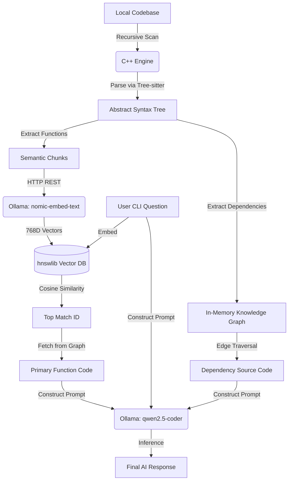

# ⚡ FastGraphRAG: Native C++ Semantic Code Analyzer


FastGraphRAG is a high-performance, privacy-first Retrieval-Augmented Generation (RAG) engine built entirely in native C++. It analyzes complex C/C++ codebases by building an Abstract Syntax Tree (AST) and mapping function dependencies into an in-memory Knowledge Graph, allowing local Large Language Models to accurately answer questions about proprietary source code without leaking data to external APIs.

Unlike standard LangChain Python wrappers that blindly chop code into text chunks, this engine performs **Semantic Code Chunking** and **Deep Context Injection**, passing both the requested function and its connected dependencies to the LLM.

---

# 🧠 System Architecture



# 🔥 Key Features

### Semantic AST Chunking

Uses the Tree-sitter C API to parse code using real grammars. Functions are kept perfectly intact, completely eliminating the hallucination risks of generic character-based text splitters.

### Native Vector Search

Utilizes hnswlib (the underlying C++ engine behind ChromaDB/Pinecone) to execute lightning-fast **O(log n)** cosine similarity searches directly in RAM.

### GraphRAG Edge Traversal

Builds a local adjacency list mapping `call_expressions`. When a target function is retrieved, the engine recursively fetches the actual source code of the functions it calls to give the LLM deep systemic context.

### Decoupled AI Microservice

Acts as a lightweight C++ orchestrator, communicating with local GPU/CPU inference servers (Ollama) via cpp-httplib to ensure zero-data-leakage and hardware flexibility.

---

# 🛠️ Tech Stack

| Component         | Technology                                   |
| ----------------- | -------------------------------------------- |
| Core Engine       | C++17                                        |
| Build System      | CMake                                        |
| AST Parser        | Tree-sitter (C API)                          |
| Vector Database   | hnswlib (Header-only C++)                    |
| Networking / JSON | cpp-httplib, nlohmann/json                   |
| AI Inference      | Ollama (`nomic-embed-text`, `qwen2.5-coder`) |

---

# 🚀 Quick Start (Arch Linux / CachyOS)

## 1. Prerequisites

Install the required build tools and Ollama inference server:

```bash
sudo pacman -S base-devel cmake git tree-sitter ollama
```

## 2. Start Inference Server & Pull Models

```bash
sudo systemctl enable --now ollama

ollama pull nomic-embed-text
ollama pull qwen2.5-coder
```

## 3. Clone and Build

```bash
git clone https://github.com/YOUR_USERNAME/FastGraphRAG-cpp.git

cd FastGraphRAG-cpp

# Initialize submodules (tree-sitter, hnswlib, httplib, json)
git submodule update --init --recursive

mkdir build
cd build

cmake ..
make
```

---

# 💻 Usage

Run the CLI tool by passing the target directory and your question.

```bash
./fastgraphrag "/path/to/your/repo" "How does the calculate_and_print function work?"
```

## Example Output

```text
Starting FastGraphRAG CLI...
Target Directory: ../test_repo
Found 1 C++ files to analyze.

Building Vector DB. Inserting 2 functions...

Searching for context related to:
"How does the calculate_and_print function work?"

-> Target Function Found:
calculate_and_print (in ../test_repo/math_ops.cpp)

[Thinking... Let the AI cook!]

================ AI ANSWER ================

Under the hood, the `calculate_and_print` function acts as an orchestrator.

1. It receives two integer parameters, `a` and `b`.
2. It executes a dependency call to `multiply(a, b)` which mathematically returns `x * y`.
3. It stores this returned integer and prints it to the standard output buffer via `std::cout`.

===========================================
```

---

# 🛣️ Future Roadmap

* Add multi-language support (Python, Rust, Go) via dynamic Tree-sitter grammar loading.
* Implement persistent Vector DB storage (save HNSW index to disk).
* Add Multi-Hop Graph Traversal (inject dependencies of dependencies).

---

# 🤝 Contributing

Pull requests are welcome!

For major changes, please open an issue first to discuss what you would like to change.

---

# 📝 License

MIT